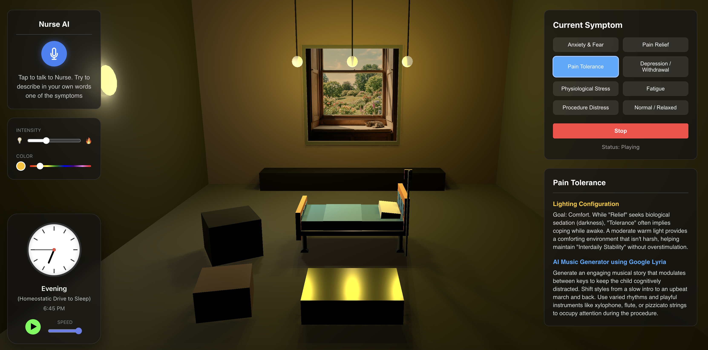

# Beatsuite by Tikkie

## Features
1. Lights and music configuration based on the research papers given
2. Music is dynamically generated using Google's Lyria 2 music generation engine
3. A voice activated AI nurse that tries to categorize the user's answer to a preset symptom
4. A fully interactive 3D environment to simulate the lights effect. User can rearrange the furniture for optimal ambiance vs lights
5. A clock that simulates the circadian rhythm of a child


## Running Locally

### Prerequisites
- Node.js (v18 or higher recommended)
- npm

### Installation

1. Navigate to the project directory.
2. Install dependencies:
   ```bash
   npm install
   ```

### Configuration

1. Create a `.env` file in the root directory.
2. Add your Gemini API key:
   ```
   VITE_GEMINI_API_KEY=your_api_key_here
   ```

### Development

Start the development server:
```bash
npm run dev
```
Open your browser and navigate to the URL shown in the terminal (usually `http://localhost:5173`).

### Unit & Integration Tests

This project uses `vitest` for testing. The tests verify the integration between the Music Generator, Light settings, and the Circadian Clock.

To run the tests:
```bash
npm run test
```

## Deployment to Google Cloud Run

This project is configured for easy deployment to Google Cloud Run.

### Prerequisites

1.  **Google Cloud SDK**: Ensure you have the `gcloud` CLI installed and authenticated.
    *   `gcloud auth login`
    *   `gcloud config set project [YOUR_PROJECT_ID]`
2.  **Billing Enabled**: Your Google Cloud project must have billing enabled.
3.  **APIs Enabled**: Enable the Cloud Run and Artifact Registry APIs.
    *   `gcloud services enable run.googleapis.com artifactregistry.googleapis.com cloudbuild.googleapis.com`

### Deploy

Run the following command in your terminal:

```bash
gcloud run deploy beatsuite-tikkie --source . --allow-unauthenticated --region us-central1
```

*   **`--source .`**: Uploads the current directory to Cloud Build, which builds the Docker image using the included `Dockerfile`.
*   **`.gcloudignore`**: This file ensures your `.env` file (containing `VITE_GEMINI_API_KEY`) is included in the build, while excluding `node_modules` and `.git`.
*   **`--allow-unauthenticated`**: Makes the app publicly accessible.

Once the command completes, it will output a **Service URL** where you can access your live application.
